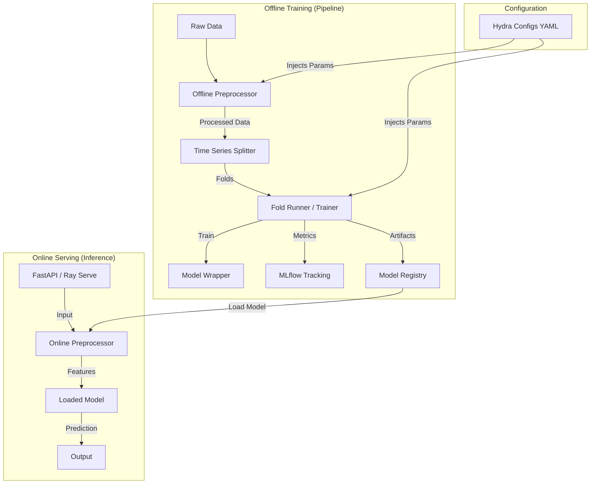

# Production-Grade Time-Series ML Pipeline

[](https://www.python.org/)
[](https://mlflow.org/)
[](https://optuna.org/)
[](https://docs.ray.io/en/latest/serve/index.html)
[](https://hydra.cc/)

A robust, modular, and extensible machine learning framework designed for Time-Series Forecasting. This project bridges the gap between research code and production systems by enforcing strict separation of concerns, reproducibility, and MLOps best practices.

---

## 🏗️ Architecture & Design Philosophy

### Core Design Principles

1.  **Training-Serving Skew Prevention**:
    * **Offline Preprocessing**: Heavy transformations (windowing, scaling) happen during training.
    * **Online Preprocessing**: Serving utilizes lightweight logic that reuses artifacts (e.g., scalers) saved during training to ensure consistency.

2.  **Configuration-Driven**:
    * All hyperparameters, model architectures, and data paths are defined in YAML files (Hydra). Code changes are rarely needed to run new experiments.

3.  **Composition over Inheritance**:
    * Pipelines are composed of independent runners, loggers, and datamodules.
    * **Factory Pattern** is used extensively (`ModelFactory`, `TrainerFactory`) to decouple implementation from instantiation.

### System Workflow



# Directory Structure
A layout designed for scalability and feature-store integration.
```plaintext
mlproject/
├── configs/                 # The "Control Center"
│   ├── base/                # Reusable defaults (model.yaml, training.yaml)
│   └── experiments/         # Experiment snapshots (etth1.yaml, tuning.yaml)
│
├── src/                     # Core Library
│   ├── datamodule/          # Data loading & splitting strategies
│   ├── eval/                # Metrics & Evaluation logic
│   ├── models/              # Model implementations (Wrappers)
│   ├── pipeline/            # Orchestrators (CV, Train, Tune, Serve)
│   ├── preprocess/          # Feature engineering (Offline vs Online)
│   ├── tracking/            # MLflow & Experiment Managers
│   ├── trainer/             # Training loops (DL vs Machine Learning)
│   └── tuning/              # Optuna Hyperparameter Search
│
├── serve/                   # Deployment Layer
│   ├── api.py               # FastAPI entry point
│   ├── ray/                 # Ray Serve deployment scripts
│   └── models_service.py    # Inference logic
│
└── tests/                   # Unit & Integration Tests
```

# Getting Started
## 1. Prerequisites
Python 3.9+

Virtual Environment (recommended)

## 2. Installation

```bash
# Create virtual environment
make venv
source mlproject_env/bin/activate

# Install dependencies
pip install -r requirements.txt
```

## 3. Quick Start
Start the MLflow server to visualize results:
```bash
mlflow ui --port 5000
```
Run a standard training experiment:
```bash
python -m mlproject.src.pipeline.run_pipeline train --config mlproject/configs/experiments/etth1.yaml
```

# Workflows & Capabilities
## 1. Cross-Validation (Backtesting)
Validates model stability across time folds.
```bash
python -m mlproject.src.pipeline.run_pipeline cv --config mlproject/configs/experiments/etth2.yaml
```

## 2. Hyperparameter Tuning (Optuna)
Runs Bayesian Optimization to find best parameters, then auto-retrains the best model.
```bash
python -m mlproject.src.pipeline.run_pipeline tune --config mlproject/configs/experiments/etth3_tuning.yaml
```
## 3. Serving (Inference)
Deploys the model using FastAPI or Ray Serve.
```bash
# Start FastAPI
uvicorn mlproject.serve.api:app --reload

# OR Start Ray Serve
python mlproject/serve/ray/ray_deploy.py
```

# Developer Guide: How to Add a New Model
This project uses the Adapter Pattern and Factory Pattern. To add a new algorithm (e.g., LightGBM or a new Transformer), follow these steps:

## Step 1: Create the Model Wrapper
Create a new file in mlproject/src/models/, inheriting from BaseModel.

```python
# mlproject/src/models/my_new_model.py
from typing import Dict, Any
from .base import BaseModel

class MyNewModel(BaseModel):
    def __init__(self, hyperparams: Dict[str, Any]):
        super().__init__(hyperparams)
        # Initialize your library model here
        self.model = SomeLibraryModel(**hyperparams)

    def fit(self, x, y, **kwargs):
        self.model.fit(x, y)

    def predict(self, x):
        return self.model.predict(x)
```

## Step 2: Register in Model Factory
Update mlproject/src/models/model_factory.py to make the factory aware of your class.
```python
# ... inside ModelFactory class
MODEL_REGISTRY = {
    "xgboost": "mlproject.src.models.xgboost_wrapper.XGBoostWrapper",
    "tft": "mlproject.src.models.tft_wrapper.TFTWrapper",
    "new_model": "mlproject.src.models.my_new_model.MyNewModel", # <--- Add this
}
```

## Step 3: Define Trainer Logic (Optional)
If your model requires a special training loop (different from standard ML fit/predict or standard Torch DataLoader), check mlproject/src/trainer/trainer_factory.py to map it to MLTrainer or DeepLearningTrainer.

```bash
# mlproject/src/trainer/trainer_factory.py
if model_name in ["new_model"]:
    entry = {"module": "mlproject.src.trainer.ml_trainer", "class": "MLTrainer"}
```

## Step 4: Create Configuration
Create a new experiment config or update model.yaml.
```yaml
# mlproject/configs/experiments/my_experiment.yaml
defaults:
  - override /base: model
experiment:
  name: "New_Model_Test"
  model: "new_model"  # Must match the key in Factory
  hyperparams:
    learning_rate: 0.01
    n_estimators: 100
```

## Quality Assurance
We enforce code quality via pre-commit hooks.
```bash
# Run all tests
make test

# Auto-format code
make style
```
