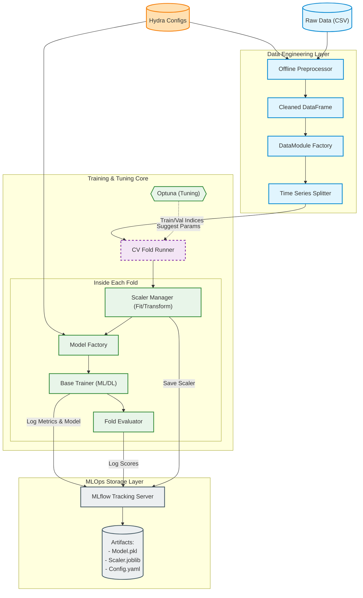
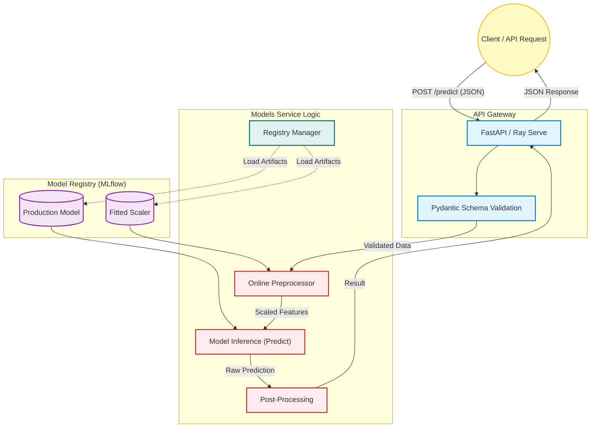

# Production-Grade Time-Series ML Pipeline

[](https://www.python.org/)
[](https://mlflow.org/)
[](https://optuna.org/)
[](https://docs.ray.io/en/latest/serve/index.html)
[](https://hydra.cc/)


A robust, modular, and extensible machine learning framework designed for Time-Series Forecasting. This project bridges the gap between research code and production systems by enforcing strict separation of concerns, reproducibility, and MLOps best practices.

---

## 🏗️ Architecture & Design Philosophy

### Core Design Principles

1.  **Training-Serving Skew Prevention**:
    * **Offline Preprocessing**: Heavy transformations (windowing, scaling) happen during training.
    * **Online Preprocessing**: Serving utilizes lightweight logic that reuses artifacts (e.g., scalers) saved during training to ensure consistency.

2.  **Configuration-Driven**:
    * All hyperparameters, model architectures, and data paths are defined in YAML files (Hydra). Code changes are rarely needed to run new experiments.

3.  **Composition over Inheritance**:
    * Pipelines are composed of independent runners, loggers, and datamodules.
    * **Factory Pattern** is used extensively (`ModelFactory`, `TrainerFactory`) to decouple implementation from instantiation.

### System Workflow

#### Training & Tuning Pipeline (Offline Workflow)
The training pipeline is orchestrated by Hydra and powered by a robust factory pattern. It supports Nested Cross-Validation, Hyperparameter Tuning (Optuna), and automatic artifact logging to MLflow.



Key Highlights:

- Modular Preprocessing: OfflinePreprocessor ensures data consistency before splitting.

- Leakage Prevention: ScalerManager fits only on the training fold and transforms validation data dynamically.

- Factory Pattern: Seamlessly switch between XGBoost, TFT, or NLinear via config model: name.
#### Inference & Serving Pipeline (Online Workflow)
The serving layer is designed to be stateless and reproducible. It strictly uses the artifacts (Models & Scalers) generated during the training phase to ensure the Training-Serving Skew is minimized.


Key Highlights:

- Consistent Transformation: OnlinePreprocessor loads the exact scaler.joblib saved during training to transform real-time data.

- Dual Serving Engines:

    + FastAPI: Lightweight, low-latency for standard deployments.

    + Ray Serve: Distributed serving for high-throughput scaling.
# Directory Structure
A layout designed for scalability and feature-store integration.
```plaintext
ml_pipeline_template/
├── .github/                   # CI/CD Workflows (GitHub Actions)
├── k8s/                       # Kubernetes Manifests (Job, Deployment, Service)
├── mlproject/
│   ├── configs/               # Hydra Configurations (The "Control Center")
│   │   ├── base/              # Base configs (model, data, training...)
│   │   └── experiments/       # Specific experiment overrides (e.g., etth3.yaml)
│   ├── data/                  # Raw data storage (git-ignored in prod)
│   ├── serve/                 # Serving Logic
│   │   ├── ray/               # Ray Serve deployment scripts
│   │   ├── api.py             # FastAPI entrypoint
│   │   └── schemas.py         # Pydantic schemas for API validation
│   ├── src/
│   │   ├── datamodule/        # Data loading, splitting, and dataset classes
│   │   ├── eval/              # Evaluation metrics & strategies
│   │   ├── models/            # Model definitions (XGBoost, NLinear, TFT...)
│   │   ├── pipeline/          # Orchestrators (Train, Tune, Serve pipelines)
│   │   ├── preprocess/        # Offline & Online data cleaning/scaling
│   │   ├── tracking/          # MLflow & Experiment management wrappers
│   │   ├── trainer/           # Training loops & logic (ML vs DL differentiation)
│   │   ├── tuning/            # Optuna hyperparameter tuning
│   │   └── utils/             # Helper functions (Shape, Factory patterns)
│   └── __init__.py
├── tests/                     # Unit & Integration Tests
├── Dockerfile                 # Multi-stage Docker build
├── Makefile                   # Handy commands for dev & ops
├── requirements.txt           # Python dependencies
└── setup.py                   # Package installation script
```

# Getting Started
## 1. Prerequisites
Python 3.9+

Virtual Environment (recommended)

## 2. Installation

```bash
# Clone the repository
git clone [https://github.com/bambootran89/ml_pipeline_template.git](https://github.com/bambootran89/ml_pipeline_template.git)
cd ml_pipeline_template

# Create Virtual Environment (Recommended)
python -m venv venv
source venv/bin/activate

# Install Dependencies
pip install -r requirements.txt
pip install -e .
```

## 3. Quick Start
Start the MLflow server to visualize results:
```bash
mlflow ui --port 5000
```
Run a standard training experiment:
```bash
python -m mlproject.src.pipeline.run_pipeline train --config mlproject/configs/experiments/etth1.yaml
```

# Workflows & Capabilities
## 1. Cross-Validation (Backtesting)
Validates model stability across time folds.
```bash
python -m mlproject.src.pipeline.run_pipeline cv --config mlproject/configs/experiments/etth2.yaml
```

## 2. Hyperparameter Tuning (Optuna)
Runs Bayesian Optimization to find best parameters, then auto-retrains the best model.
```bash
python -m mlproject.src.pipeline.run_pipeline tune --config mlproject/configs/experiments/etth3_tuning.yaml
```
## 3. Serving (Inference)
Deploys the model using FastAPI or Ray Serve.
```bash
# Start FastAPI
uvicorn mlproject.serve.api:app --reload

# OR Start Ray Serve
python mlproject/serve/ray/ray_deploy.py
```

# Developer Guide: How to Add a New Model
This project uses the Adapter Pattern and Factory Pattern. To add a new algorithm (e.g., LightGBM or a new Transformer), follow these steps:

## Step 1: Create the Model Wrapper
Create a new file in mlproject/src/models/, inheriting from BaseModel.

```python
# mlproject/src/models/my_new_model.py
from typing import Dict, Any
from .base import BaseModel

class MyNewModel(BaseModel):
    def __init__(self, hyperparams: Dict[str, Any]):
        super().__init__(hyperparams)
        # Initialize your library model here
        self.model = SomeLibraryModel(**hyperparams)

    def fit(self, x, y, **kwargs):
        self.model.fit(x, y)

    def predict(self, x):
        return self.model.predict(x)
```

## Step 2: Register in Model Factory
Update mlproject/src/models/model_factory.py to make the factory aware of your class.
```python
# ... inside ModelFactory class
MODEL_REGISTRY = {
    "xgboost": "mlproject.src.models.xgboost_wrapper.XGBoostWrapper",
    "tft": "mlproject.src.models.tft_wrapper.TFTWrapper",
    "new_model": "mlproject.src.models.my_new_model.MyNewModel", # <--- Add this
}
```

## Step 3: Define Trainer Logic (Optional)
If your model requires a special training loop (different from standard ML fit/predict or standard Torch DataLoader), check mlproject/src/trainer/trainer_factory.py to map it to MLTrainer or DeepLearningTrainer.

```bash
# mlproject/src/trainer/trainer_factory.py
if model_name in ["new_model"]:
    entry = {"module": "mlproject.src.trainer.ml_trainer", "class": "MLTrainer"}
```

## Step 4: Create Configuration
Create a new experiment config or update model.yaml.
```yaml
# mlproject/configs/experiments/my_experiment.yaml
defaults:
  - override /base: model
experiment:
  name: "New_Model_Test"
  model: "new_model"  # Must match the key in Factory
  hyperparams:
    learning_rate: 0.01
    n_estimators: 100
```

## Quality Assurance
We enforce code quality via pre-commit hooks.
```bash
# Run all tests
make test

# Auto-format code
make style
```

## Docker & Kubernetes
Build Docker Image
```bash
docker build -t ml-pipeline:latest .
```

Run Locally with Docker
```bash
docker run -p 8000:8000 ml-pipeline:latest
```

Deploy to Kubernetes
```bash
# Apply Training Job
kubectl apply -f k8s/job-training.yaml

# Apply API Service
kubectl apply -f k8s/deployment-api.yaml
kubectl apply -f k8s/service-api.yaml
```

## Key Features
- Engineered for Reliability: Includes Type Hinting (mypy), Linting (flake8, pylint), and Unit Tests (pytest).

- Experiment Tracking: Built-in integration with MLflow for logging metrics, params, and artifacts.

- Scalable Serving: Supports both lightweight FastAPI and distributed Ray Serve.