# Production-Grade Time-Series ML Pipeline

[](https://www.python.org/)
[](https://mlflow.org/)
[](https://optuna.org/)
[](https://docs.ray.io/en/latest/serve/index.html)
[](https://hydra.cc/)


A robust, modular, and extensible machine learning framework designed for Time-Series Forecasting. This project bridges the gap between research code and production systems by enforcing strict separation of concerns, reproducibility, and MLOps best practices.

---

## 🏗️ Architecture & Design Philosophy

### Core Design Principles

1.  **Training-Serving Skew Prevention**:
    * **Offline Preprocessing**: Heavy transformations (windowing, scaling) happen during training.
    * **Online Preprocessing**: Serving utilizes lightweight logic that reuses artifacts (e.g., scalers) saved during training to ensure consistency.

2.  **Configuration-Driven**:
    * All hyperparameters, model architectures, and data paths are defined in YAML files (Hydra). Code changes are rarely needed to run new experiments.

3.  **Composition over Inheritance**:
    * Pipelines are composed of independent runners, loggers, and datamodules.
    * **Factory Pattern** is used extensively (`ModelFactory`, `TrainerFactory`) to decouple implementation from instantiation.

### System Workflow

#### Training & Tuning Pipeline (Offline Workflow)
The training pipeline is orchestrated by Hydra and powered by a robust factory pattern. It supports Nested Cross-Validation, Hyperparameter Tuning (Optuna), and automatic artifact logging to MLflow.

```mermaid
%%{init: {
  "theme": "default",
  "flowchart": {
    "nodeSpacing": 60,
    "rankSpacing": 70
  },
  "themeVariables": {
    "fontFamily": "Inter, Arial",
    "fontSize": "14px",
    "primaryTextColor": "#111",
    "lineColor": "#333"
  }
}}%%

flowchart TD
    %% Global Styles
    classDef config fill:#fff3e0,stroke:#ef6c00,stroke-width:2px;
    classDef data fill:#e3f2fd,stroke:#1565c0,stroke-width:2px;
    classDef core fill:#e8f5e9,stroke:#2e7d32,stroke-width:2px;
    classDef loop fill:#f3e5f5,stroke:#7b1fa2,stroke-width:2px,stroke-dasharray: 5 5;
    classDef artifact fill:#eceff1,stroke:#455a64,stroke-width:2px;

    %% Nodes
    Hydra[("Hydra<br/>Configs")]:::config
    RawData[("Raw Data<br/>(CSV)")]:::data
    
    subgraph DataEngineering ["Data Engineering Layer"]
        OfflinePrep["Offline<br/>Preprocessor"]:::data
        CleanData["Cleaned<br/>DataFrame"]:::data
        FactoryDM["DataModule<br/>Factory"]:::data
        Splitter["Time Series<br/>Splitter"]:::data
    end

    subgraph TrainingLoop ["Training & Tuning Core"]
        Optuna{{"Optuna<br/>(Tuning)"}}:::core
        CVRun["CV Fold<br/>Runner"]:::loop
        
        subgraph FoldExecution ["Inside Each Fold"]
            Scaler["Scaler Manager<br/>(Fit / Transform)"]:::core
            ModelFac["Model<br/>Factory"]:::core
            Trainer["Base Trainer<br/>(ML / DL)"]:::core
            Evaluator["Fold<br/>Evaluator"]:::core
        end
    end

    subgraph ArtifactStore ["MLOps Storage Layer"]
        MLflow["MLflow<br/>Tracking Server"]:::artifact
        Artifacts[("Artifacts<br/>• Model.pkl<br/>• Scaler.joblib<br/>• Config.yaml")]:::artifact
    end

    %% Flow
    Hydra --> OfflinePrep
    Hydra --> ModelFac
    RawData --> OfflinePrep
    OfflinePrep --> CleanData
    CleanData --> FactoryDM
    FactoryDM --> Splitter
    
    Splitter -- "Train / Val Indices" --> CVRun
    Optuna -.->|"Suggest<br/>Params"| CVRun
    
    CVRun --> Scaler
    Scaler --> ModelFac
    ModelFac --> Trainer
    Trainer --> Evaluator
    
    Trainer -- "Log Metrics<br/>Model" --> MLflow
    Evaluator -- "Log Scores" --> MLflow
    Scaler -- "Save Scaler" --> MLflow
    
    MLflow --> Artifacts
```




Key Highlights:

- Modular Preprocessing: OfflinePreprocessor ensures data consistency before splitting.

- Leakage Prevention: ScalerManager fits only on the training fold and transforms validation data dynamically.

- Factory Pattern: Seamlessly switch between XGBoost, TFT, or NLinear via config model: name.
#### Inference & Serving Pipeline (Online Workflow)
The serving layer is designed to be stateless and reproducible. It strictly uses the artifacts (Models & Scalers) generated during the training phase to ensure the Training-Serving Skew is minimized.


Key Highlights:

- Consistent Transformation: OnlinePreprocessor loads the exact scaler.joblib saved during training to transform real-time data.

- Dual Serving Engines:

    + FastAPI: Lightweight, low-latency for standard deployments.

    + Ray Serve: Distributed serving for high-throughput scaling.
# Directory Structure
A layout designed for scalability and feature-store integration.
```plaintext
ml_pipeline_template/
├── .github/                   # CI/CD Workflows (GitHub Actions)
├── k8s/                       # Kubernetes Manifests (Job, Deployment, Service)
├── mlproject/
│   ├── configs/               # Hydra Configurations (The "Control Center")
│   │   ├── base/              # Base configs (model, data, training...)
│   │   └── experiments/       # Specific experiment overrides (e.g., etth3.yaml)
│   ├── data/                  # Raw data storage (git-ignored in prod)
│   ├── serve/                 # Serving Logic
│   │   ├── ray/               # Ray Serve deployment scripts
│   │   ├── api.py             # FastAPI entrypoint
│   │   └── schemas.py         # Pydantic schemas for API validation
│   ├── src/
│   │   ├── datamodule/        # Data loading, splitting, and dataset classes
│   │   ├── eval/              # Evaluation metrics & strategies
│   │   ├── models/            # Model definitions (XGBoost, NLinear, TFT...)
│   │   ├── pipeline/          # Orchestrators (Train, Tune, Serve pipelines)
│   │   ├── preprocess/        # Offline & Online data cleaning/scaling
│   │   ├── tracking/          # MLflow & Experiment management wrappers
│   │   ├── trainer/           # Training loops & logic (ML vs DL differentiation)
│   │   ├── tuning/            # Optuna hyperparameter tuning
│   │   └── utils/             # Helper functions (Shape, Factory patterns)
│   └── __init__.py
├── tests/                     # Unit & Integration Tests
├── Dockerfile                 # Multi-stage Docker build
├── Makefile                   # Handy commands for dev & ops
├── requirements.txt           # Python dependencies
└── setup.py                   # Package installation script
```

# Getting Started
## 1. Prerequisites
Python 3.9+

Virtual Environment (recommended)

## 2. Installation

```bash
# Clone the repository
git clone [https://github.com/bambootran89/ml_pipeline_template.git](https://github.com/bambootran89/ml_pipeline_template.git)
cd ml_pipeline_template

# Create Virtual Environment (Recommended)
python -m venv venv
source venv/bin/activate

# Install Dependencies
pip install -r requirements.txt
pip install -e .
```

## 3. Quick Start
Start the MLflow server to visualize results:
```bash
mlflow ui --port 5000
```
Run a standard training experiment:
```bash
python -m mlproject.src.pipeline.run_pipeline train --config mlproject/configs/experiments/etth1.yaml
```

# Workflows & Capabilities
## 1. Cross-Validation (Backtesting)
Validates model stability across time folds.
```bash
python -m mlproject.src.pipeline.run_pipeline cv --config mlproject/configs/experiments/etth2.yaml
```

## 2. Hyperparameter Tuning (Optuna)
Runs Bayesian Optimization to find best parameters, then auto-retrains the best model.
```bash
python -m mlproject.src.pipeline.run_pipeline tune --config mlproject/configs/experiments/etth3_tuning.yaml
```
## 3. Serving (Inference)
Deploys the model using FastAPI or Ray Serve.
```bash
# Start FastAPI
uvicorn mlproject.serve.api:app --reload

# OR Start Ray Serve
python mlproject/serve/ray/ray_deploy.py
```

# Developer Guide: How to Add a New Model
This project uses the Adapter Pattern and Factory Pattern. To add a new algorithm (e.g., LightGBM or a new Transformer), follow these steps:

## Step 1: Create the Model Wrapper
Create a new file in mlproject/src/models/, inheriting from MLModelWrapper.

Example: mlproject/src/models/catboost_wrapper.py

```python
from catboost import CatBoostRegressor
from mlproject.src.models.base import MLModelWrapper
import numpy as np

class CatBoostWrapper(MLModelWrapper):
    def build(self, input_dim: int, output_dim: int) -> None:
        # Load params from hydra config
        iterations = self.cfg.get("iterations", 1000)
        learning_rate = self.cfg.get("learning_rate", 0.05)
        
        self.model = CatBoostRegressor(
            iterations=iterations,
            learning_rate=learning_rate,
            loss_function='RMSE',
            verbose=0
        )

    def fit(self, x, y, x_val=None, y_val=None, **kwargs):
        # Handle shape flattening if necessary (Time Series -> Tabular)
        x_flat = x.reshape(x.shape[0], -1) 
        eval_set = (x_val.reshape(x_val.shape[0], -1), y_val) if x_val is not None else None
        
        self.model.fit(x_flat, y, eval_set=eval_set, early_stopping_rounds=50)

    def predict(self, x):
        x_flat = x.reshape(x.shape[0], -1)
        return self.model.predict(x_flat)
```

## Step 2: Register in Model Factory
Update mlproject/src/models/model_factory.py to recognize the new class.
```python
# ... imports
from mlproject.src.models.catboost_wrapper import CatBoostWrapper

class ModelFactory(FactoryBase):
    def get_model_class(self, name: str) -> Type[MLModelWrapper]:
        if name == "xgboost":
            return XGBWrapper
        elif name == "nlinear":
            return NLinearWrapper
        elif name == "catboost":  # <--- Add this line
            return CatBoostWrapper
        else:
            raise ValueError(f"Unknown model name: {name}")
```

## Step 3: Define Configuration
Add a new config file: mlproject/configs/experiments/catboost_etth1.yaml.

```yaml
# @package _global_
defaults:
  - override /base/model: null 

model:
  name: "catboost"  # Matches the key in Factory
  params:
    iterations: 2000
    learning_rate: 0.03
    depth: 6
```

Run it:
```bash 
python -m mlproject.src.pipeline.run_pipeline train --config mlproject/configs/experiments/catboost_etth1.yaml
```
## Hyperparameter Tuning Guide
This framework integrates Optuna for automated hyperparameter optimization.

1. Define Search Space
Modify mlproject/src/tuning/search_space.py to define the range for your new model.
```python
def get_search_space(trial, model_name):
    if model_name == "xgboost":
        return {
            "n_estimators": trial.suggest_int("n_estimators", 100, 1000),
            "max_depth": trial.suggest_int("max_depth", 3, 10),
            "learning_rate": trial.suggest_float("learning_rate", 0.01, 0.3, log=True)
        }
    elif model_name == "catboost":
        return {
            "iterations": trial.suggest_int("iterations", 500, 3000),
            "depth": trial.suggest_int("depth", 4, 10)
        }
```
2. Create Tuning Config
Create a tuning configuration file, e.g., mlproject/configs/experiments/etth3_tuning.yaml.

```yaml 
# @package _global_
defaults:
  - override /base/tuning: tuning  # Load base tuning settings

tuning:
  n_trials: 20            # Number of Optuna trials
  metric: "val_loss"      # Metric to minimize
  direction: "minimize"
  storage: "sqlite:///db.sqlite3" # Persistent storage for resume capability

model:
  name: "xgboost"         # Model to tune
```
3. Run Optimization

```bash
python -m mlproject.src.pipeline.run_pipeline tune --config mlproject/configs/experiments/etth3_tuning.yaml
```

## Quality Assurance
We enforce code quality via pre-commit hooks.
```bash
# Run all tests
make test

# Auto-format code
make style
```

## Docker & Kubernetes
Build Docker Image
```bash
docker build -t ml-pipeline:latest .
```

Run Locally with Docker
```bash
docker run -p 8000:8000 ml-pipeline:latest
```

Deploy to Kubernetes
```bash
# Apply Training Job
kubectl apply -f k8s/job-training.yaml

# Apply API Service
kubectl apply -f k8s/deployment-api.yaml
kubectl apply -f k8s/service-api.yaml
```

## Key Features
- Engineered for Reliability: Includes Type Hinting (mypy), Linting (flake8, pylint), and Unit Tests (pytest).

- Experiment Tracking: Built-in integration with MLflow for logging metrics, params, and artifacts.

- Scalable Serving: Supports both lightweight FastAPI and distributed Ray Serve.