# Production-Grade Time-Series ML Pipeline

[](https://www.python.org/)
[](https://mlflow.org/)
[](https://optuna.org/)
[](https://docs.ray.io/en/latest/serve/index.html)
[](https://hydra.cc/)


A robust, modular, and extensible machine learning framework designed for Time-Series Forecasting. This project bridges the gap between research code and production systems by enforcing strict separation of concerns, reproducibility, and MLOps best practices.

---

## 🏗️ Architecture & Design Philosophy

### Core Design Principles


#### Unified Artifact Packaging (Training-Serving Skew Prevention)

- **Self-Contained Artifacts**:
  Instead of storing only the model weights, the system packages both the **Stateful Preprocessor** and the **Model** together inside a single **PyFuncWrapper**. This ensures that preprocessing and model inference are always consistent.

- **Zero Logic Duplication**:
  The serving environment does not reimplement any data processing logic. It simply **hydrates** the learned state from training, guaranteeing **100% consistency** between training and serving.


#### Distributed & Async Architecture

- **Decoupled Microservices**:
  Using **Ray Serve**, Feature Engineering (CPU-bound) and Model Inference (GPU-bound) are split into independent **Actors**, allowing each to scale independently based on load.

- **Non-blocking I/O**:
  Heavy computation is handled with **Async/Await** and **ThreadPool**, preventing the API's main event loop from being blocked while executing CPU-intensive tasks.

## Modular & Configuration-Driven

- **Hydra Configs**:
  All experiment parameters, model architectures, and dataset paths are managed through **YAML** configuration files, enabling reproducibility and flexible experiment management.

- **Factory Pattern**:
  The training pipeline leverages the **Factory Pattern** (e.g., `ModelFactory`, `TrainerFactory`) to separate **instantiation** from execution logic. This design makes it easy to add new algorithms without modifying core pipeline code.


### System Workflow

#### Training & Tuning Pipeline (Offline Workflow)
The training pipeline is orchestrated by Hydra and powered by a robust factory pattern. It supports Nested Cross-Validation, Hyperparameter Tuning (Optuna), and automatic artifact logging to MLflow.


Key Highlights:

- Modular Preprocessing: OfflinePreprocessor ensures data consistency before splitting.

- Leakage Prevention: ScalerManager fits only on the training fold and transforms validation data dynamically.

- Factory Pattern: Seamlessly switch between XGBoost, TFT, or NLinear via config model: name.
#### Inference & Serving Pipeline (Online Workflow)
The serving layer is designed to be stateless and reproducible. It strictly uses the artifacts (Models & Scalers) generated during the training phase to ensure the Training-Serving Skew is minimized.

```mermaid
%%{init: {
  "theme": "base",
  "flowchart": {"nodeSpacing":60,"rankSpacing":80,"curve":"basis"},
  "themeVariables": {"primaryColor":"#e3f2fd","edgeLabelBackground":"#fff","fontFamily":"Inter, Arial, sans-serif","fontSize":"14px"}
}}%%

flowchart TD
    %% --- Styles ---
    classDef client fill:#fff9c4,stroke:#fbc02d,stroke-width:2px;
    classDef gateway fill:#bbdefb,stroke:#1976d2,stroke-width:2px;
    classDef compute fill:#c8e6c9,stroke:#2e7d32,stroke-width:2px;
    classDef storage fill:#e1bee7,stroke:#6a1b9a,stroke-width:2px,stroke-dasharray:5 5;
    classDef hotpath stroke:#d32f2f,stroke-width:2px;
    classDef coldpath stroke:#0288d1,stroke-width:2px,stroke-dasharray:5 5;
    classDef note fill:#fff3e0,stroke:#fb8c00,stroke-width:1px,font-style:italic;

    %% --- Client ---
    Client(("Client App")):::client

    %% --- Ray Serve Cluster ---
    subgraph RayCluster ["☁️ Ray Serve Cluster"]
        direction TB

        %% Ingress Layer
        subgraph Gateway ["API & Validation Layer"]
            API["Forecast API"]:::gateway
            Validator["Schema Validator"]:::gateway
        end

        %% Compute Layer
        subgraph Compute ["Distributed Compute Layer"]
            direction TB
            subgraph Preprocess ["Preprocessing Service"]
                PrepActor["Stateful Preprocessor"]:::compute
                ThreadPool["Async ThreadPool"]:::compute
                PrepActor <--> ThreadPool
            end

            subgraph Inference ["Inference Service"]
                ModelActor["Model Server"]:::compute
            end
        end
    end

    %% --- Artifact Storage ---
    MLflow["MLflow Artifact Registry"]:::storage

    %% --- Hot Path (Solid Red) ---
    Client == "1. POST /predict" ==> API:::hotpath
    API --> Validator:::hotpath
    Validator -- "2. Validated Data" --> PrepActor:::hotpath
    PrepActor -- "3. Feature Vectors" --> ModelActor:::hotpath
    ModelActor -- "4. Raw Prediction" --> API:::hotpath
    API == "5. JSON Response" ==> Client:::hotpath

    %% --- Cold Path (Dotted Blue) ---
    MLflow -.-> |"Load Preprocessor"| PrepActor:::coldpath
    MLflow -.-> |"Load Model Binary"| ModelActor:::coldpath
    ModelActor -.-> |"Run ID Sync"| PrepActor:::coldpath

    %% --- Annotations ---
    Note1["Async: Preprocessing does not block Inference"]:::note -.-> PrepActor
    Note2["Version Consistency: Preprocessor matches Model"]:::note -.-> MLflow

```



Key Highlights:

- Consistent Transformation: OnlinePreprocessor loads the exact scaler.joblib saved during training to transform real-time data.

- Dual Serving Engines:

    + FastAPI: Lightweight, low-latency for standard deployments.

    + Ray Serve: Distributed serving for high-throughput scaling.
# Directory Structure
A layout designed for scalability and feature-store integration.
```plaintext
ml_pipeline_template/
├── .github/                   # CI/CD Workflows (GitHub Actions)
├── k8s/                       # Kubernetes Manifests (Job, Deployment, Service)
├── mlproject/
│   ├── configs/               # Hydra Configurations (The "Control Center")
│   │   ├── base/              # Base configs (model, data, training...)
│   │   └── experiments/       # Specific experiment overrides (e.g., etth1.yaml)
│   ├── data/                  # Raw data storage (git-ignored in prod)
│   ├── serve/                 # Serving Logic
│   │   ├── ray/               # Ray Serve deployment scripts (ray_deploy.py)
│   │   ├── api.py             # FastAPI entrypoint (Local/Docker basic serving)
│   │   ├── models_service.py  # Model loading & inference logic independent of API
│   │   └── schemas.py         # Pydantic schemas for API validation
│   ├── src/
│   │   ├── datamodule/        # Data loading, splitting, and dataset classes
│   │   ├── eval/              # Evaluation metrics & strategies
│   │   ├── models/            # Model definitions (XGBoost, NLinear, TFT...)
│   │   ├── pipeline/          # Orchestrators (Train, Eval, Serve pipelines)
│   │   │   └── engines/       # Execution engines (CV Fold Runner, Tuning Pipeline)
│   │   ├── preprocess/        # Offline & Online data cleaning/scaling
│   │   ├── tracking/          # MLflow wrappers (Experiment, Run, Registry, PyFunc)
│   │   ├── trainer/           # Training loops (ML vs DL differentiation)
│   │   ├── tuning/            # Optuna hyperparameter tuning logic
│   │   └── utils/             # Helper functions (ConfigLoader, MLflowUtils...)
│   ├── run.py                 # Main CLI entrypoint (Training/Prediction)
│   └── __init__.py
├── tests/                     # Unit & Integration Tests (End2End, Ray, Pipeline...)
├── Dockerfile                 # Multi-stage Docker build
├── Makefile                   # Handy commands for dev & ops
├── requirements.txt           # Python dependencies
└── setup.py                   # Package installation script
```

# Getting Started
## 1. Prerequisites
Python 3.9+

Virtual Environment (recommended)

## 2. Installation

```bash
# Clone the repository
git clone [https://github.com/bambootran89/ml_pipeline_template.git](https://github.com/bambootran89/ml_pipeline_template.git)
cd ml_pipeline_template

# Create Virtual Environment (Recommended)
python -m venv venv
source venv/bin/activate

# Install Dependencies
pip install -r requirements.txt
pip install -e .
```

## 3. Quality Assurance
We enforce code quality via pre-commit hooks.
```bash
# Run all tests
make test

# Auto-format code
make style
```

## 4. Quick Start
Start the MLflow server to visualize results:
```bash
mlflow ui --port 5000
```
Run a standard training experiment:
```bash
python -m mlproject.src.pipeline.run_pipeline train --config mlproject/configs/experiments/etth1.yaml
```

# Workflows & Capabilities
## 1. Cross-Validation (Backtesting)
Validates model stability across time folds.
```bash
python -m mlproject.src.pipeline.run_pipeline cv --config mlproject/configs/experiments/etth2.yaml
```

## 2. Hyperparameter Tuning (Optuna)
Runs Bayesian Optimization to find best parameters, then auto-retrains the best model.
```bash
python -m mlproject.src.pipeline.run_pipeline tune --config mlproject/configs/experiments/etth3_tuning.yaml
```
## 3. Serving (Inference)
Deploys the model using FastAPI.
```bash
# Start FastAPI
uvicorn mlproject.serve.api:app --reload
```
Deploys the model using Ray Serve.
```bash
# OR Start Ray Serve
python mlproject/serve/ray/ray_deploy.py
```
Test API services
```bash

curl -X POST http://localhost:8000/predict   -H "Content-Type: application/json"   -d '{
    "data": {
      "HUFL": [-0.15, 0.08, 0.01, -0.01, 0.21, -0.15, 0.12, 0.05, -0.08, 0.18, -0.12, 0.22, 0.03, -0.18, 0.15, -0.05, 0.28, -0.22, 0.08, -0.15, 0.32, -0.28, 0.12, -0.18],
      "MUFL": [1.14, 1.06, 0.93, 1.11, 0.96, 1.05, 0.98, 1.12, 0.95, 1.08, 0.92, 1.15, 0.88, 1.22, 0.85, 1.18, 0.82, 1.25, 0.78, 1.32, 0.75, 1.38, 0.72, 1.42],
      "mobility_inflow": [1.24, 4.42, 7.28, 1.03, 0.73, 2.5, 3.2, 4.1, 1.8, 5.3, 2.1, 6.4, 1.5, 7.8, 3.6, 4.9, 2.7, 8.2, 1.9, 5.5, 3.8, 6.7, 2.3, 4.2]
    }
  }'
```


## Docker & Kubernetes
Build Docker Image
```bash
docker build -t ml-pipeline:latest .
```

Run Locally with Docker
```bash
docker run -p 8000:8000 ml-pipeline:latest
```

Deploy to Kubernetes
```bash
# Apply Training Job
kubectl apply -f k8s/job-training.yaml

# Apply API Service
kubectl apply -f k8s/deployment-api.yaml
kubectl apply -f k8s/service-api.yaml
```

## Key Features
- Engineered for Reliability: Includes Type Hinting (mypy), Linting (flake8, pylint), and Unit Tests (pytest).

- Experiment Tracking: Built-in integration with MLflow for logging metrics, params, and artifacts.

- Scalable Serving: Supports both lightweight FastAPI and distributed Ray Serve.
