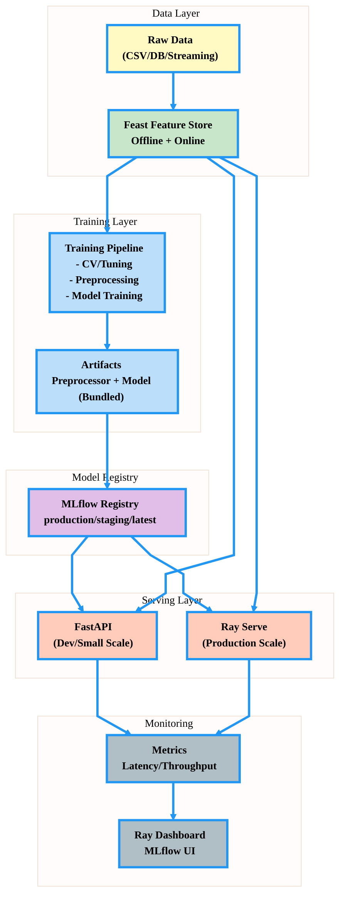
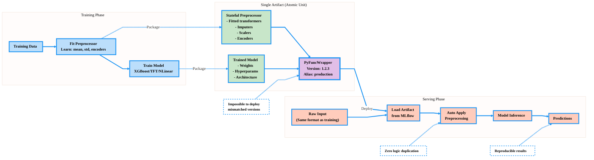
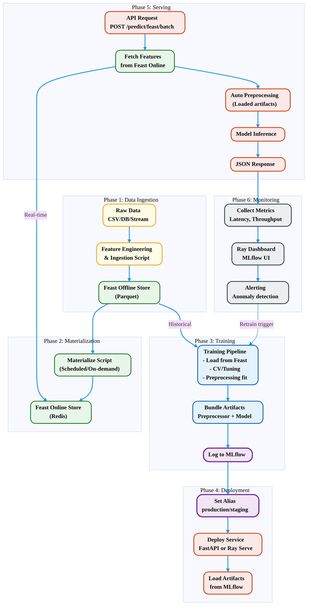

# Architecture & Design Philosophy

## Overview

This ML platform is engineered for **production-grade time series forecasting** with emphasis on:
- **Eliminating training-serving skew** through unified artifact packaging
- **Feature Store integration** for consistent feature engineering
- **Distributed serving** with Ray for scalability
- **Design patterns** (Strategy, Facade, Factory) for maintainability
- **MLOps best practices** (versioning, monitoring, reproducibility)

---

## 1. System Architecture Overview

---

## 2. Unified Artifact Packaging (Anti-Skew Design)

**Core Principle:** Preprocessor and Model are **inseparable, versioned together**.

**Benefits:**
- **Atomic Deployment**: Preprocessor + Model deploy together
- **Zero Skew**: Same preprocessing in training/serving
- **Versioning**: Single version for entire pipeline
- **Rollback**: Revert to any previous version instantly

---

## 3. Feast Feature Store Integration

**Key Features:**

| Feature | Training (Offline) | Serving (Online) |
|---------|-------------------|------------------|
| **Storage** | Parquet/BigQuery/Snowflake | Redis/DynamoDB/Cassandra |
| **Latency** | Seconds to minutes | <10ms |
| **Data Volume** | TB+ historical data | KB per entity |
| **Use Case** | Backtesting, CV, Training | Real-time inference |
| **Query Type** | Batch, time-travel | Point lookup |

---

## 4. Design Patterns

### 4.1 Strategy Pattern (Feature Retrieval)

**Benefits:**
- **Open-Closed Principle**: Add new strategies without modifying client
- **Single Responsibility**: Each strategy handles one retrieval type
- **Testability**: Easy to mock strategies

### 4.2 Facade Pattern (Simplified Feature Access)

## 5. Distributed Serving Architecture (Ray Serve)

**Key Features:**
- **Independent Scaling**: Each service scales based on its bottleneck
- **Async Non-blocking**: No service blocks others
- **Fault Isolation**: Service crash doesn't affect others
- **Resource Efficiency**: GPU only for inference

## 6. MLflow Model Registry (Deployment Strategy)

**Benefits:**
- **A/B Testing**: Run staging and production in parallel
- **Instant Rollback**: Change alias, no redeployment
- **Zero Downtime**: Alias switch is atomic
- **Traceability**: Every version logged with metrics

---

## 7. Complete End-to-End Flow

**Timeline:**
1. **Data Ingestion**: Daily/Hourly (Batch)
2. **Materialization**: Hourly/Real-time (Sync)
3. **Training**: Weekly/On-demand (CV + Tuning)
4. **Deployment**: After validation (Alias switch)
5. **Serving**: 24/7 (Real-time)
6. **Monitoring**: Continuous (Metrics collection)

---

## Key Takeaways

### For Data Scientists
- **Focus on modeling**: Preprocessing handled automatically
- **Experiment tracking**: All runs logged to MLflow
- **Easy experimentation**: Change config, not code
- **Reproducibility**: Versioned artifacts + configs

### For MLOps Engineers
- **Zero-skew deployment**: Preprocessor + Model bundled
- **Alias-based rollout**: production/staging/latest
- **Scalable serving**: Ray Serve auto-scaling
- **Monitoring**: Built-in metrics and dashboards

### For Data Engineers
- **Feature Store**: Feast for feature management
- **Consistent features**: Same definitions for training/serving
- **Materialization**: Offline → Online sync
- **Multi-entity**: Batch queries for efficiency

---
