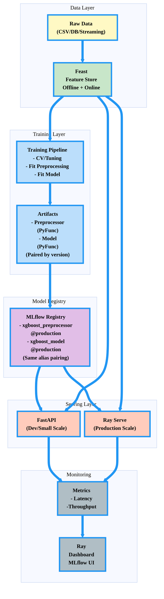
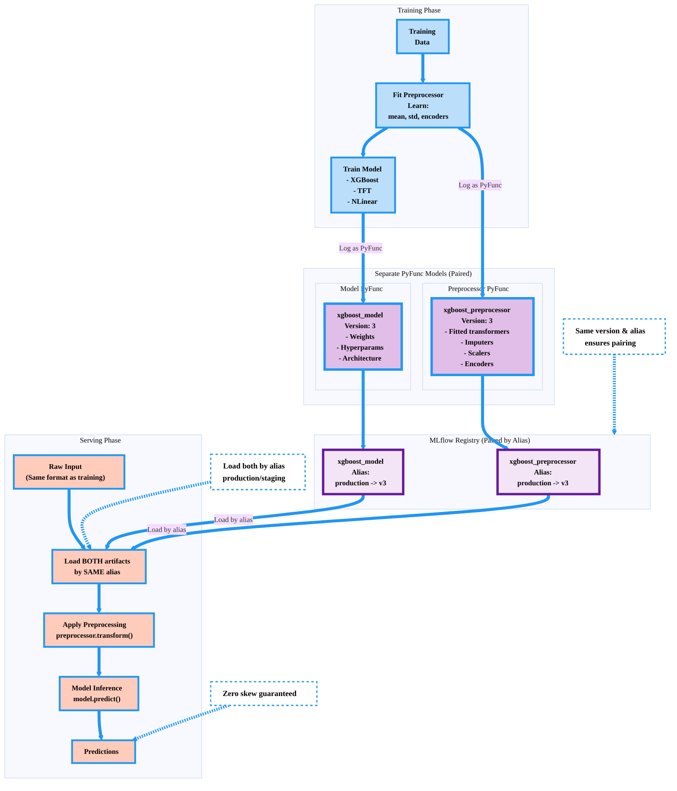
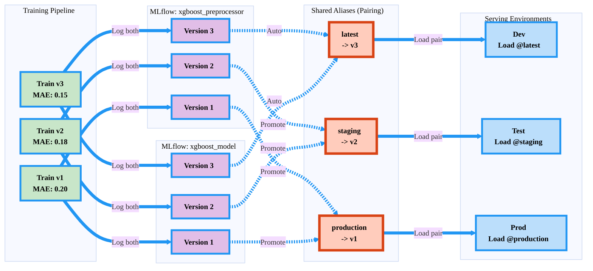
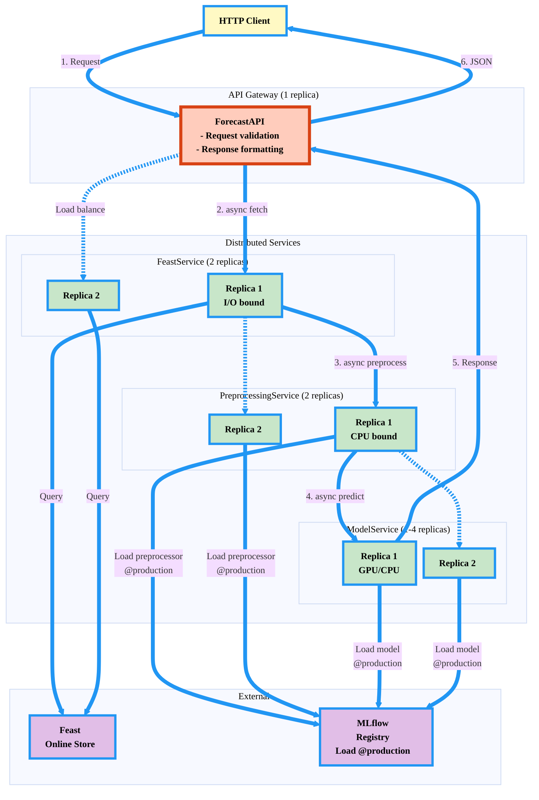
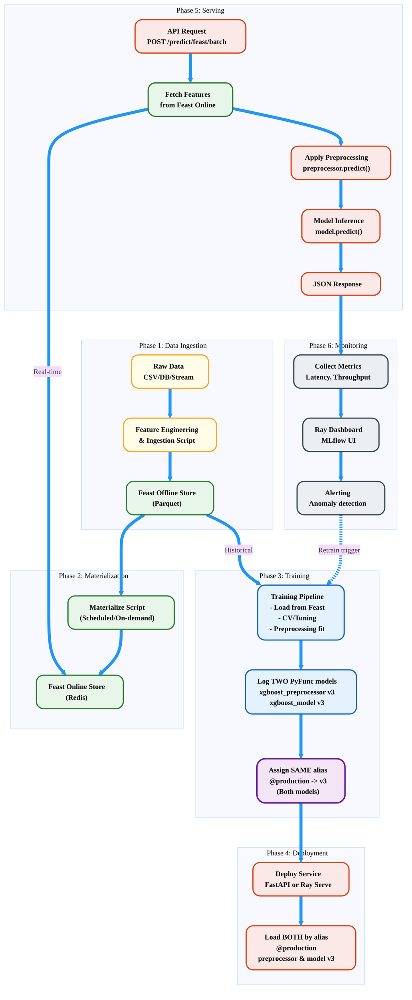

# Architecture & Design Philosophy

## Overview

This ML platform is designed for **production-ready ML projects**, emphasizing:
- **Eliminating training-serving skew** through versioned artifact pairing
- **Feature Store integration** for consistent feature engineering
- **Distributed serving** with Ray for scalability
- **Design patterns** (Strategy, Facade, Factory) for maintainability
- **MLOps best practices** (versioning, monitoring, reproducibility)

---

## 1. System Architecture Overview



---

## 2. Dual PyFunc Artifact Packaging (Anti-Skew Design)

**Core Principle:** Preprocessor and Model are **separate PyFunc models** but **paired by version/alias**.



**Key Design:**
- **Two separate PyFunc models**: `{model}_preprocessor` and `{model}_model`
- **Paired by version**: Both get same version number (e.g., v3)
- **Paired by alias**: Both assigned same alias (e.g., production)
- **Atomic deployment**: Load both by alias ensures consistency
- **Independent versioning**: Can track preprocessor vs model changes

---

## 3. MLflow Registry Structure



**MLflow UI View:**
```
Models/
|-- xgboost_preprocessor
|   |-- Version 3 (latest)    <- Latest training
|   |-- Version 2 (staging)   <- Testing
|   +-- Version 1 (production) <- Live traffic
|
+-- xgboost_model
    |-- Version 3 (latest)    <- Paired with preprocessor v3
    |-- Version 2 (staging)   <- Paired with preprocessor v2
    +-- Version 1 (production) <- Paired with preprocessor v1
```

**Benefits:**
- **Independent tracking**: See preprocessor vs model changes separately
- **Alias pairing**: Load both by same alias guarantees consistency
- **A/B testing**: Run staging (v2) and production (v1) in parallel
- **Rollback safety**: Revert both by changing alias
- **Audit trail**: Clear version history for each component

---

## 4. Feast Feature Store Integration

**Key Features:**

| Feature | Training (Offline) | Serving (Online) |
|---------|-------------------|------------------|
| **Storage** | Parquet/BigQuery/Snowflake | Redis/DynamoDB/Cassandra |
| **Latency** | Seconds to minutes | <10ms |
| **Data Volume** | TB+ historical data | KB per entity |
| **Use Case** | Backtesting, CV, Training | Real-time inference |
| **Query Type** | Batch, time-travel | Point lookup |

---

## 5. Design Patterns

### 5.1 Strategy Pattern (Feature Retrieval)

**Benefits:**
- **Open-Closed Principle**: Add new strategies without modifying client
- **Single Responsibility**: Each strategy handles one retrieval type
- **Testability**: Easy to mock strategies

### 5.2 Facade Pattern (Simplified Feature Access)

**Benefits:**
- **Simplified interface**: 3 lines vs 30 lines of Feast API calls
- **Encapsulates complexity**: Hides Feature Store, Strategy, Factory details
- **Easy testing**: Single point to mock

---

## 6. Distributed Serving Architecture (Ray Serve)



**Service Scaling:**

| Service | Bottleneck | Replicas | Resource | Auto-scale Trigger |
|---------|-----------|----------|----------|-------------------|
| **ForecastAPI** | HTTP routing | 1 | 0.5 CPU | Request queue |
| **FeastService** | I/O latency | 2-4 | 0.5 CPU | Feast query time |
| **PreprocessingService** | CPU computation | 2-4 | 1-2 CPU | CPU >70% |
| **ModelService** | GPU/CPU inference | 1-4 | 1 GPU or 4 CPU | GPU >80% |

**Key Features:**
- **Independent Scaling**: Each service scales based on bottleneck
- **Async Non-blocking**: Parallel execution
- **Fault Isolation**: Service crash doesn't cascade
- **Resource Efficiency**: GPU only for inference

---

## 7. Complete End-to-End Flow



**Timeline:**
1. **Data Ingestion**: Daily/Hourly (Batch)
2. **Materialization**: Hourly/Real-time (Sync)
3. **Training**: Weekly/On-demand (CV + Tuning)
4. **Deployment**: After validation (Alias assignment to both models)
5. **Serving**: 24/7 (Load both by alias, apply sequentially)
6. **Monitoring**: Continuous (Metrics collection)

---

## Key Takeaways

### For Data Scientists
- **Focus on modeling**: Preprocessing handled automatically
- **Experiment tracking**: All runs logged to MLflow
- **Easy experimentation**: Change config, not code
- **Reproducibility**: Versioned artifacts + configs

### For MLOps Engineers
- **Dual PyFunc deployment**: Separate but paired models
- **Alias-based pairing**: Load both by same alias (production/staging/latest)
- **Atomic consistency**: Version matching enforced by alias
- **Scalable serving**: Ray Serve auto-scaling
- **Monitoring**: Built-in metrics and dashboards

### For Data Engineers
- **Feature Store**: Feast for feature management
- **Consistent features**: Same definitions for training/serving
- **Materialization**: Offline -> Online sync
- **Multi-entity**: Batch queries for efficiency

---


**Safety Guarantees:**
- **Version tracking**: Each component has independent version history
- **Alias pairing**: Loading by alias ensures matching versions
- **Rollback**: Change alias on both to revert
- **A/B testing**: Different aliases for different environments
- **Zero skew**: Impossible to load mismatched preprocessor+model

---
