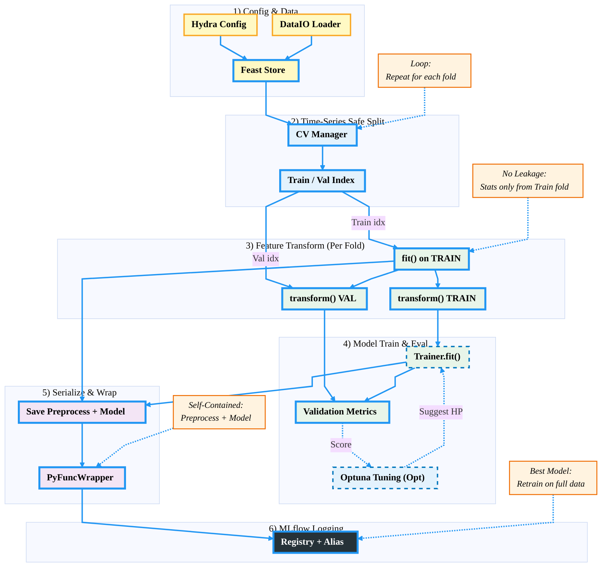

# Offline Workflow (Training Pipeline)

## Overview

The training pipeline orchestrates model development with emphasis on:
- **Anti-leakage**: Preprocessing fitted only on training folds
- **Reproducibility**: All experiments tracked in MLflow
- **Hyperparameter tuning**: Optuna integration
- **Cross-validation**: Time-series aware splitting
- **Artifact bundling**: Preprocessor + Model packaged together

---

## Complete Training Flow



---

## Phase 1: Configuration & Data Loading

**Key Config Parameters:**
```yaml
# etth1_feast.yaml
data:
  path: "feast://weather_repo"  # Feast URI
  type: "timeseries"
  featureview: "hourly_features"
  features: ["HUFL", "MUFL", "mobility_inflow"]
  target_columns: ["HUFL"]
  start_date: "2023-01-01"
  end_date: "2023-12-31"
  entity_key: "location_id"
  entity_id: 1

experiment:
  model: "xgboost"
  hyperparams:
    n_estimators: 100
    learning_rate: 0.1
```

---

## Phase 2: Cross-Validation (Time-Series Aware)

## Phase 3: Feature Engineering (Per Fold)

## Phase 4: Model Training with Optuna

**Optuna Config:**
```yaml
tuning:
  n_trials: 30
  n_splits: 3
  optimize_metric: "mae_mean"
  direction: "minimize"

  # Parameter search space
  xgboost:
    n_estimators:
      type: "int"
      range: [50, 300]
    learning_rate:
      type: "float"
      range: [0.01, 0.1]
      log: true
    max_depth:
      type: "int"
      range: [3, 10]
```

## Phase 5: Artifact Packaging

## Phase 6: MLflow Logging

---

## Summary: Complete Pipeline Flow

**Command:**
```bash
python -m mlproject.src.pipeline.run train \
  --config mlproject/configs/experiments/etth1_feast.yaml
```

**Steps:**
1. Load config via Hydra
2. Load data from Feast (historical)
3. Split into CV folds (time-series aware)
4. For each fold:
   - Fit preprocessor on TRAIN
   - Transform TRAIN and VAL
   - Train model with suggested hyperparams
   - Evaluate on VAL
   - Report metrics to Optuna
5. Select best hyperparameters
6. Retrain on full dataset
7. Package preprocessor + model
8. Log to MLflow Registry
9. Assign alias (latest/staging/production)

**Output:**
- MLflow Run with all metrics, params, artifacts
- Registered model version ready for deployment
- Reproducible artifact bundle

**Key Guarantees:**
- **No data leakage**: Val never seen during preprocessing fit
- **Bundled artifacts**: Preprocessor + Model together
- **Reproducible**: Config + Version → Exact same result
- **Tracked**: All experiments logged to MLflow
