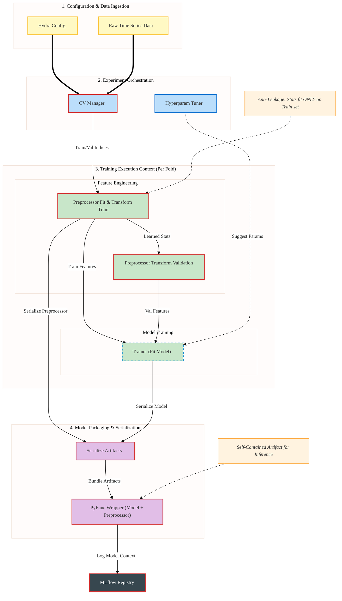

```mermaid
%%{init: {
  "theme": "base",
  "flowchart": {"nodeSpacing":60,"rankSpacing":80,"curve":"basis"},
  "themeVariables": {"primaryColor":"#e3f2fd","edgeLabelBackground":"#fff","fontFamily":"Inter, Arial, sans-serif","fontSize":"14px"}
}}%%

flowchart TD
    %% --- Styles ---
    classDef input fill:#fff9c4,stroke:#fbc02d,stroke-width:2px;
    classDef orchestrator fill:#bbdefb,stroke:#1976d2,stroke-width:2px;
    classDef compute fill:#c8e6c9,stroke:#2e7d32,stroke-width:2px;
    classDef package fill:#e1bee7,stroke:#6a1b9a,stroke-width:2px;
    classDef storage fill:#37474f,stroke:#263238,stroke-width:2px,color:#fff;
    classDef hotpath stroke:#d32f2f,stroke-width:2px;
    classDef parampath stroke:#0288d1,stroke-width:2px,stroke-dasharray:5 5;
    classDef note fill:#fff3e0,stroke:#fb8c00,stroke-width:1px,font-style:italic;

    %% --- Input Layer ---
    subgraph InputLayer ["1. Configuration & Data Ingestion"]
        Config["Hydra Config"]:::input
        Dataset["Raw Time Series Data"]:::input
    end

    %% --- Orchestration Layer ---
    subgraph Orchestrator ["2. Experiment Orchestration"]
        CVManager["CV Manager"]:::orchestrator
        Optuna["Hyperparam Tuner"]:::orchestrator
    end

    %% --- Compute Layer ---
    subgraph ComputeLayer ["3. Training Execution Context (Per Fold)"]
        direction TB
        subgraph DataOps ["Feature Engineering"]
            TransFit["Preprocessor Fit & Transform Train"]:::compute
            TransApply["Preprocessor Transform Validation"]:::compute
        end
        subgraph ModelOps ["Model Training"]
            Trainer["Trainer (Fit Model)"]:::compute
        end
    end

    %% --- Packaging Layer ---
    subgraph Packaging ["4. Model Packaging & Serialization"]
        Serializer["Serialize Artifacts"]:::package
        Wrapper["PyFunc Wrapper (Model + Preprocessor)"]:::package
    end

    %% --- Storage Layer ---
    MLflow["MLflow Registry"]:::storage

    %% --- Hot Path Connections (Solid Red) ---
    Config & Dataset ==> CVManager:::hotpath
    CVManager -- "Train/Val Indices" --> TransFit:::hotpath
    TransFit -- "Learned Stats" --> TransApply:::hotpath
    TransFit -- "Train Features" --> Trainer:::hotpath
    TransApply -- "Val Features" --> Trainer:::hotpath

    %% Packaging Flow (Hot Path)
    TransFit -- "Serialize Preprocessor" --> Serializer:::hotpath
    Trainer -- "Serialize Model" --> Serializer:::hotpath
    Serializer -- "Bundle Artifacts" --> Wrapper:::hotpath
    Wrapper -- "Log Model Context" --> MLflow:::hotpath

    %% Parameter / Suggestion Flow (Dashed Blue)
    Optuna -.-> |"Suggest Params"| Trainer:::parampath

    %% --- Annotations ---
    Note1["Anti-Leakage: Stats fit ONLY on Train set"]:::note -.-> TransFit
    Note2["Self-Contained Artifact for Inference"]:::note -.-> Wrapper
```
