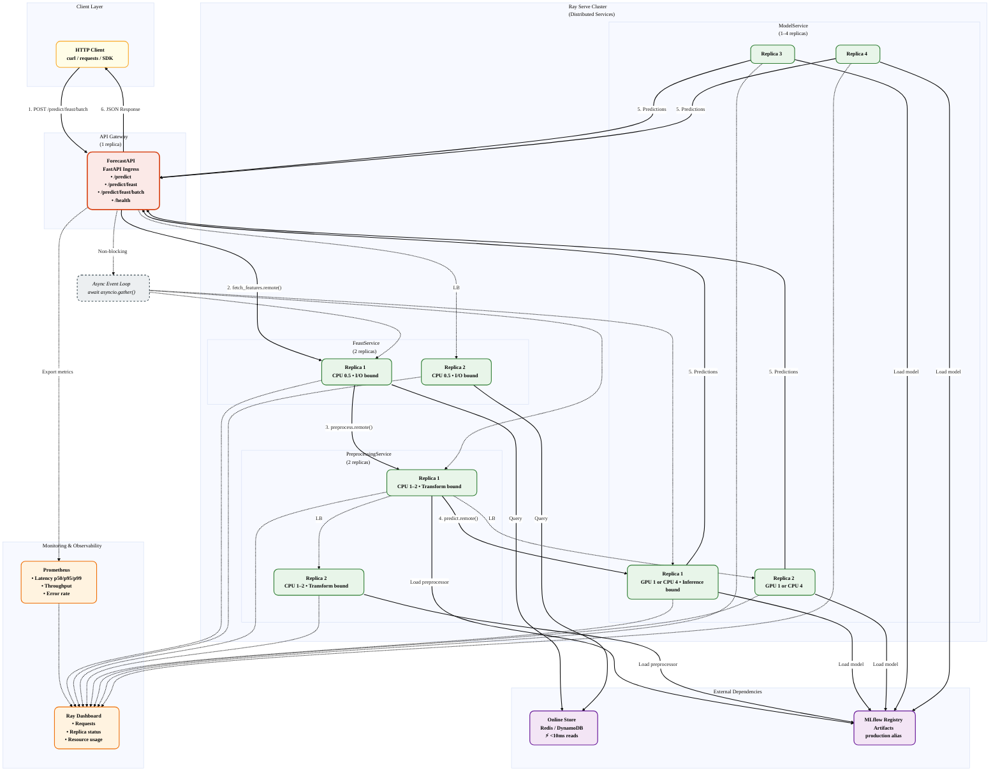
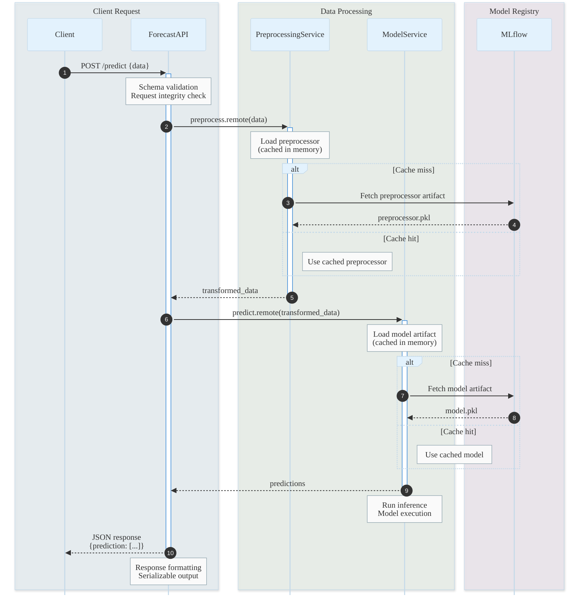
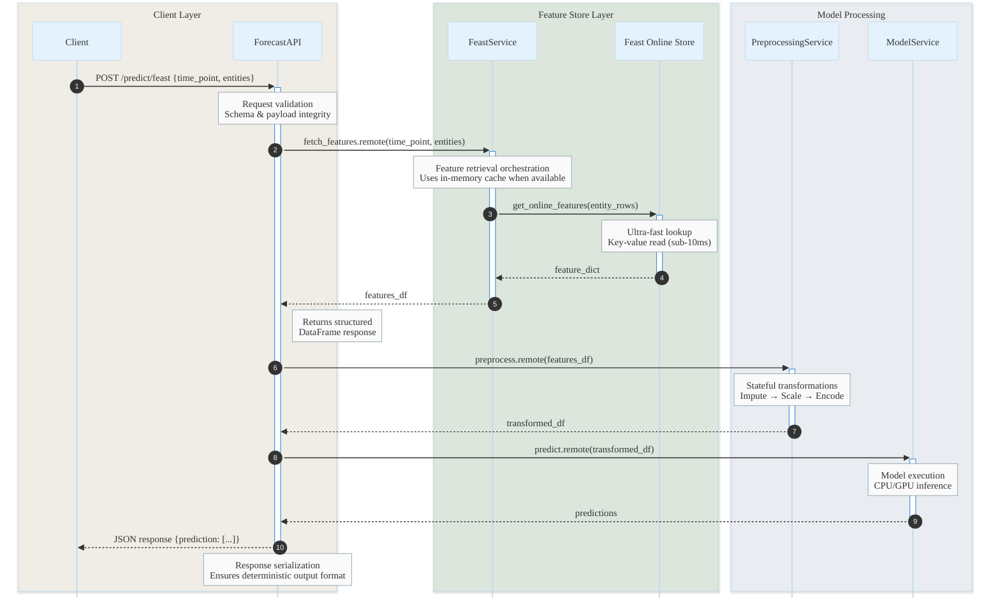
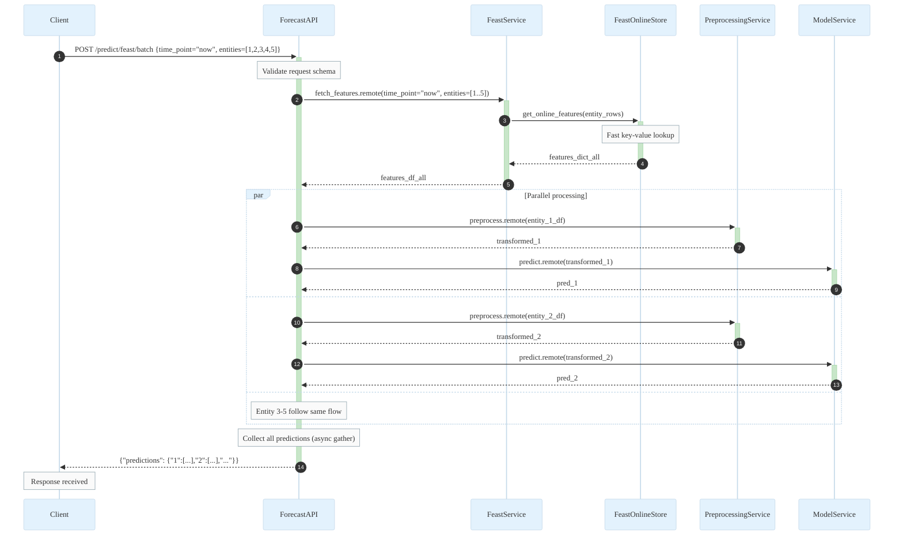
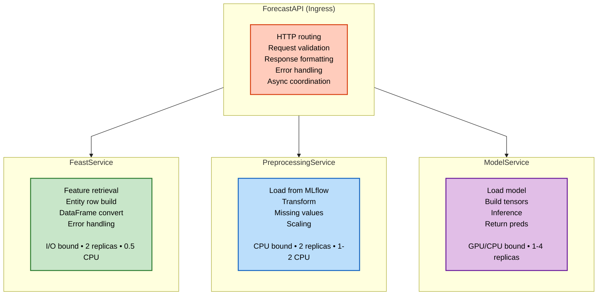
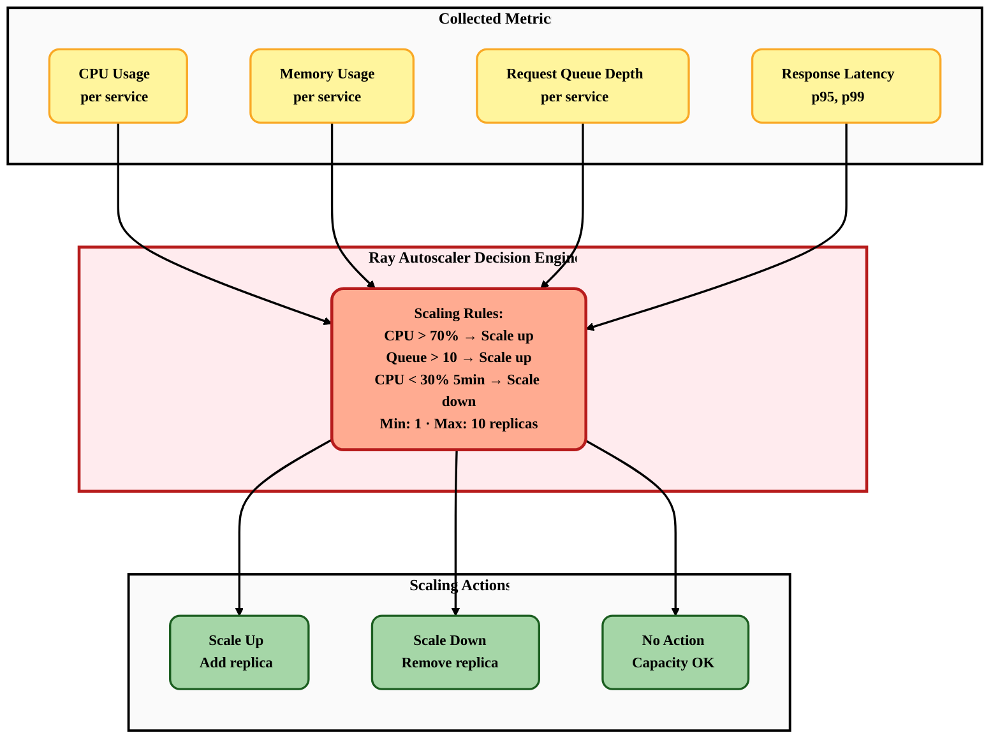
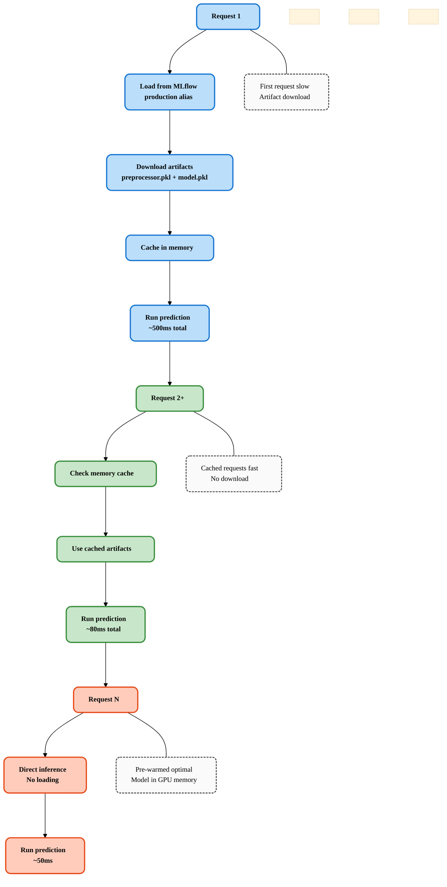
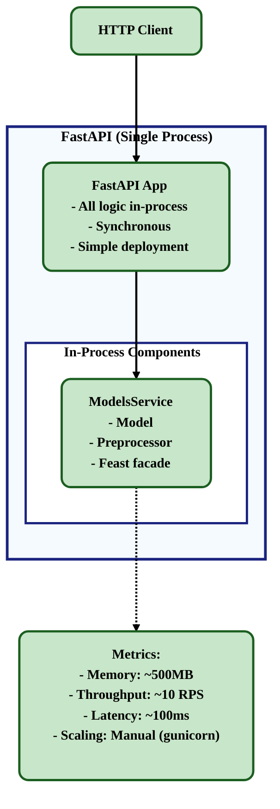
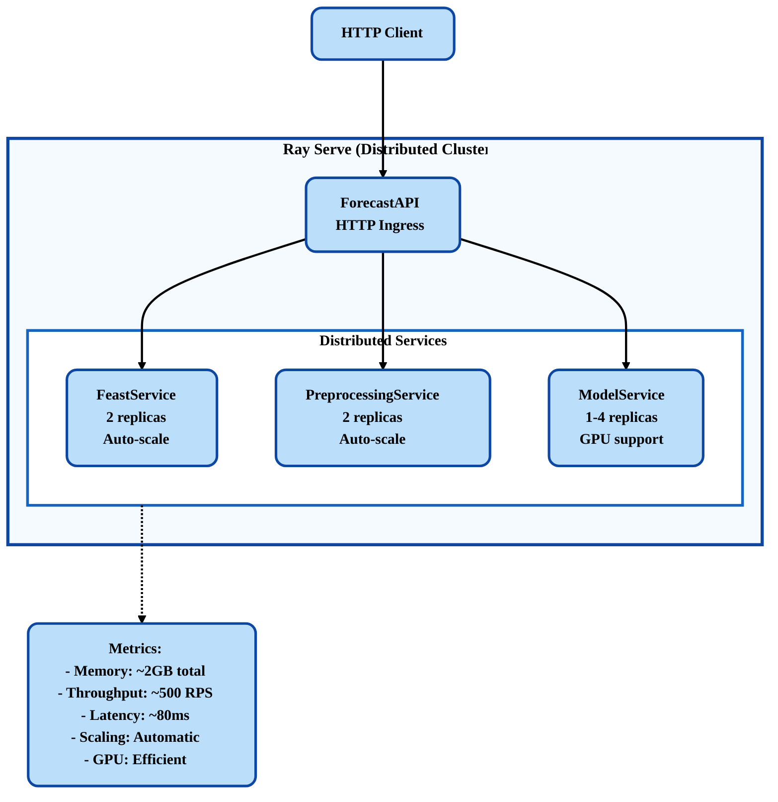

# Online Workflow (Serving Pipeline)

## Overview

The serving pipeline delivers real-time predictions with:
- **Distributed services**: Ray Serve for independent scaling
- **Feast integration**: Real-time feature retrieval
- **Zero-skew guarantee**: Uses bundled artifacts from training
- **Multi-entity batch**: Efficient batch predictions
- **Async coordination**: Non-blocking I/O

---

## Complete Serving Architecture



---

## Request Flow Details

### 1. Traditional Prediction (Data in Payload)



**Latency Breakdown:**
- Validation: ~1ms
- Preprocessing: ~50ms
- Model inference: ~30ms
- **Total: ~80ms** (after cache warmup)

---

### 2. Feast-Native Prediction (Single Entity)



**Latency Breakdown:**
- Validation: ~1ms
- Feast query: ~10ms (Redis)
- Preprocessing: ~50ms
- Model inference: ~30ms
- **Total: ~90ms**

**Key Advantage:** Client doesn't need to fetch features!

---

### 3. Batch Prediction (Multi-Entity)



**Performance:**
- **Single Feast query** for all entities (efficient!)
- **Parallel preprocessing** and inference
- **5 entities processed in ~200ms** (vs 450ms sequential)

**Scaling:** 100 entities in ~500ms (Ray auto-scales services)

---

## Service Responsibilities



---

## Auto-Scaling Configuration




---

## Artifact Loading & Caching



**Pre-warming Strategy:**
```python
# In service __init__
async def _warmup(self):
    """Load artifacts during service startup"""
    if self.mlflow_manager.enabled:
        model_name = self.cfg.experiment["model"].lower()

        # Load preprocessor
        self.preprocessor = self.mlflow_manager.load_component(
            name=f"{model_name}_preprocessor",
            alias="production"  # Always load production
        )

        # Load model
        self.model = self.mlflow_manager.load_component(
            name=f"{model_name}_model",
            alias="production"
        )

        self.ready = True
        print("[Service] Pre-warmed and ready")
```

---

## Monitoring & Observability

### Ray Dashboard (Built-in)

```
http://localhost:8265

Dashboard Metrics:
├── Cluster Overview
│   ├── Total nodes: 3
│   ├── Total CPUs: 24
│   └── Total GPUs: 2
│
├── Deployments
│   ├── ForecastAPI
│   │   ├── Replicas: 1/1
│   │   └── Requests: 1,234 total, 45 RPS
│   │
│   ├── FeastService
│   │   ├── Replicas: 2/2
│   │   ├── CPU usage: 45%
│   │   └── Queue depth: 0
│   │
│   ├── PreprocessingService
│   │   ├── Replicas: 2/2
│   │   ├── CPU usage: 68%
│   │   └── Queue depth: 2
│   │
│   └── ModelService
│       ├── Replicas: 1/1
│       ├── GPU usage: 82%
│       └── Latency p95: 45ms
│
└── Metrics
    ├── Request latency
    │   ├── p50: 80ms
    │   ├── p95: 120ms
    │   └── p99: 180ms
    │
    └── Throughput
        └── 45 requests/sec
```

### Custom Metrics

```python
# Export to Prometheus
from prometheus_client import Counter, Histogram

# Request counter
requests_total = Counter(
    'forecast_requests_total',
    'Total requests',
    ['endpoint', 'status']
)

# Latency histogram
request_duration = Histogram(
    'forecast_request_duration_seconds',
    'Request duration',
    ['endpoint']
)

# In endpoint
@app.post("/predict/feast")
async def predict_feast(request):
    with request_duration.labels(endpoint="feast").time():
        try:
            result = await process(request)
            requests_total.labels(
                endpoint="feast",
                status="success"
            ).inc()
            return result
        except Exception as e:
            requests_total.labels(
                endpoint="feast",
                status="error"
            ).inc()
            raise
```

---

## Deployment Comparison

### FastAPI (Simple)



**Use Cases:**
- Development/Testing
- Low traffic (<100 RPS)
- Simple deployment
- No auto-scaling
- No GPU optimization

---

### Ray Serve (Production)



**Use Cases:**
- Production serving
- High traffic (>100 RPS)
- Auto-scaling needed
- GPU inference
- Multi-model serving
- Higher complexity

---

## Summary

**Key Features:**
- **Distributed**: Ray Serve for independent scaling
- **Fast**: Async coordination, sub-100ms latency
- **Zero-skew**: Bundled artifacts from training
- **Multi-entity**: Efficient batch predictions
- **Observable**: Built-in metrics and dashboards

**Deployment Command:**
```bash
# Ray Serve
python mlproject/serve/ray_deploy.py

# OR FastAPI (simpler)
python mlproject/serve/api.py
```

**Endpoints:**
- `POST /predict` - Traditional (data in payload)
- `POST /predict/feast` - Feast single/multi-entity
- `POST /predict/feast/batch` - Batch multi-entity (efficient)
- `GET /health` - Health check

**Serving Flow:**
1. Load artifacts from MLflow (cached)
2. Fetch features from Feast Online Store
3. Apply preprocessing (bundled with model)
4. Run inference
5. Return predictions

**Performance:**
- Single prediction: ~80ms
- Batch (5 entities): ~200ms
- Batch (100 entities): ~500ms
- Throughput: 50-500 RPS (Ray Serve)
