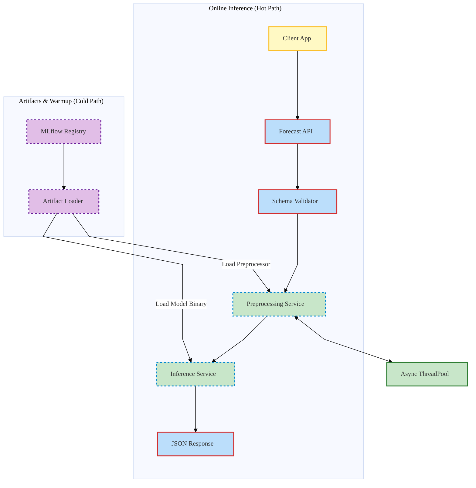

```mermaid
%%{init: {
  "theme": "base",
  "flowchart": {
    "nodeSpacing": 80,
    "rankSpacing": 100,
    "curve": "linear"
  },
  "themeVariables": {
    "fontFamily": "Inter, Arial, sans-serif",
    "fontSize": "14px",
    "edgeLabelBackground": "#ffffff"
  }
}}%%

flowchart TD

%% =========================
%% Style Definitions
%% =========================
classDef client  fill:#fff9c4,stroke:#fbc02d,stroke-width:2px;
classDef gateway fill:#bbdefb,stroke:#1976d2,stroke-width:2px;
classDef compute fill:#c8e6c9,stroke:#2e7d32,stroke-width:2px;
classDef storage fill:#e1bee7,stroke:#6a1b9a,stroke-width:2px,stroke-dasharray:4 4;
classDef hot      stroke:#d32f2f,stroke-width:2px;
classDef cold     stroke:#0288d1,stroke-width:2px,stroke-dasharray:4 4;

%% =========================
%% Hot Path — Online Inference
%% =========================
subgraph HOT["Online Inference (Hot Path)"]
    direction TB

    Client["Client App"]:::client
    API["Forecast API"]:::gateway
    Validator["Schema Validator"]:::gateway
    Preprocess["Preprocessing Service"]:::compute
    Model["Inference Service"]:::compute
    Response["JSON Response"]:::gateway

    Client --> API:::hot
    API --> Validator:::hot
    Validator --> Preprocess:::hot
    Preprocess --> Model:::hot
    Model --> Response:::hot
end

%% =========================
%% Async Execution (Local)
%% =========================
AsyncPool["Async ThreadPool"]:::compute
Preprocess <--> AsyncPool

%% =========================
%% Cold Path — Artifact Warmup
%% =========================
subgraph COLD["Artifacts & Warmup (Cold Path)"]
    direction TB

    MLflow["MLflow Registry"]:::storage
    ArtifactHub["Artifact Loader"]:::storage

    MLflow --> ArtifactHub
    ArtifactHub -->|Load Preprocessor| Preprocess:::cold
    ArtifactHub -->|Load Model Binary| Model:::cold
end

```
