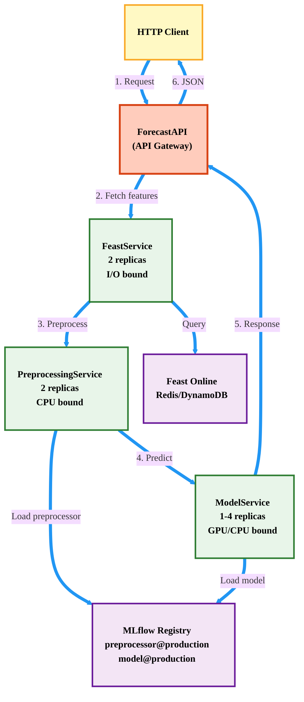

# Online Workflow (Serving Pipeline)

## Overview

The serving pipeline delivers real-time predictions with:
- **Distributed services**: Ray Serve for independent scaling
- **Feast integration**: Real-time feature retrieval
- **Dual PyFunc loading**: Separate preprocessor and model artifacts paired by alias
- **Multi-entity batch**: Efficient batch predictions
- **Async coordination**: Non-blocking I/O

---

## Complete Serving Architecture



---

## Request  Types

### 1. Traditional Prediction (Data in Payload)

### 2. Feast-Native Prediction (Single Entity)

### 3. Batch Prediction (Multi-Entity)

## Summary

**Key Features:**
- **Distributed**: Ray Serve for independent scaling
- **Fast**: Async coordination, sub-100ms latency
- **Dual PyFunc**: Separate preprocessor and model artifacts paired by alias
- **Multi-entity**: Efficient batch predictions
- **Observable**: Built-in metrics and dashboards

**Deployment Command:**
```bash
# Ray Serve (production)
python mlproject/serve/ray_deploy.py

# FastAPI (development/simple)
python mlproject/serve/api.py
```

**Endpoints:**
- `POST /predict` - Traditional (data in payload)
- `POST /predict/feast` - Feast single/multi-entity
- `POST /predict/feast/batch` - Batch multi-entity (efficient)
- `GET /health` - Health check

**Serving Flow:**
1. Load TWO artifacts from MLflow by SAME alias (cached)
   - xgboost_preprocessor@production
   - xgboost_model@production
2. Fetch features from Feast Online Store
3. Apply preprocessing using preprocessor PyFunc
4. Run inference using model PyFunc
5. Return predictions

**Artifact Pairing:**
- Preprocessor and Model loaded by SAME alias
- Version matching enforced by alias system
- Impossible to load mismatched versions
- Rollback by changing alias on both
